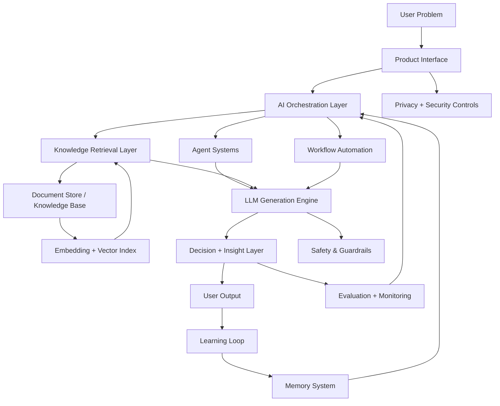
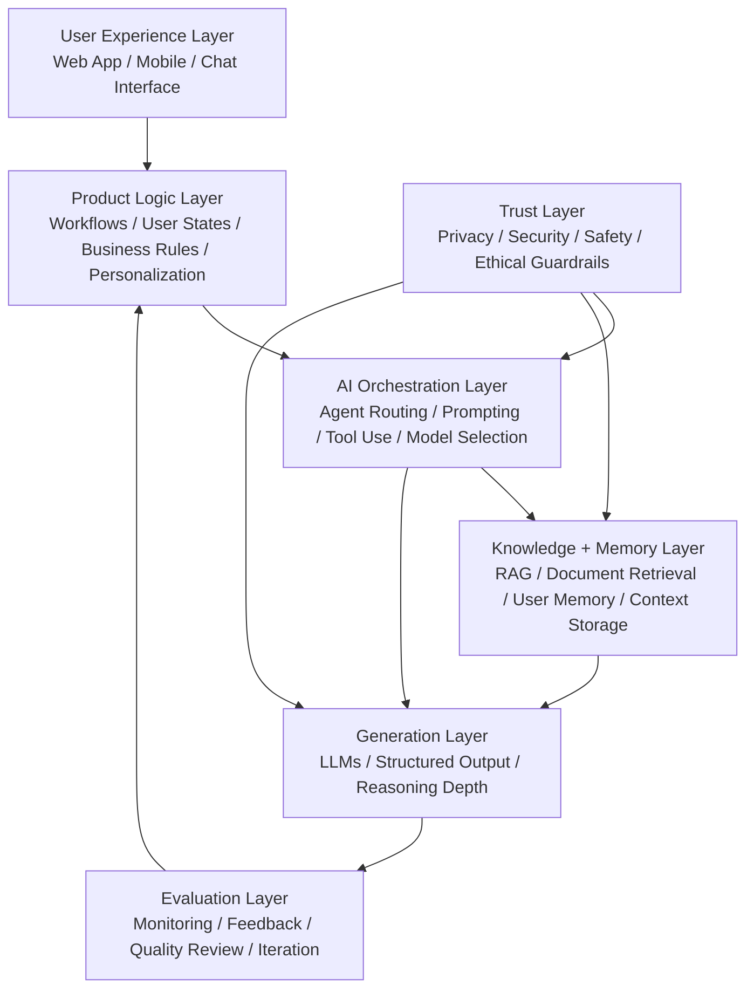

# 👋 Hi, I'm Jamil

🚀 **AI Builder | Senior Product Manager**

Designing AI-native products, multi-agent systems, and intelligent product workflows.

My work focuses on combining **product strategy, AI system design, and modern LLM architectures** to build scalable AI-powered applications.

---

## 🔨 Core AI Builder Principles

• Design for the user problem first, not the model first  
• Use retrieval and memory to ground outputs in context  
• Treat privacy, security, and safety as system requirements  
• Build evaluation and feedback loops into the product  
• Use orchestration to combine agents, tools, and documents effectively  
• Prefer structured workflows over one-shot generation

## 🧠 AI Builder Framework

User Problem  
↓  
Product Interface  
↓  
AI Orchestration  
↓  
Agents / Retrieval / Tools  
↓  
LLM Generation  
↓  
Structured Output  
↓  
Evaluation + Learning  
↓  
Memory

---

## 🧠 AI Builder System Architecture

---

## 🧱 AI Product Stack

---

### How I Think About AI Products

I design AI systems as layered products rather than isolated prompts.

My approach typically includes:

• user-centered product interfaces  
• workflow and decision logic  
• AI orchestration and routing  
• retrieval and memory systems  
• privacy, security, and safety guardrails  
• evaluation loops for continuous improvement

---

## 🚀 What I Build

• AI product operating systems  
• Multi-agent workflows  
• AI-powered product discovery tools  
• AI applications using RAG and LLMs  

---

## 🧠 Areas of Interest

AI Agents  
RAG Systems  
Product Strategy Automation  
AI Product Management  

---

## 🧱 AI Builder Stack

🧠 **AI Systems**  
Multi-agent architectures • RAG systems • LLM workflows • AI orchestration

🧭 **Product Leadership**  
Product strategy • Roadmaps • PRDs • User research • Product analytics

⚙️ **AI Infrastructure**  
Vector search • knowledge retrieval • memory systems • evaluation pipelines

🔒 **Responsible AI**  
Privacy by design • security • guardrails • ethical AI systems

## ⚙️ Tech Stack

OpenAI  
Anthropic  
Supabase  
Ollama  
Replit  
VS Code  
GitHub  

## 🛠️ Tools & Technologies

---

## ⭐ Current Projects

• **AI Product Management OS** — AI system for automating PRDs, prioritization, roadmaps, and product insights.

• **Multi-Agent Product Strategy Simulator** — agent workflow that simulates product roles across strategy, analytics, and planning.

• **HeroMinutes** — AI-powered athlete recovery and injury support platform.

---

## 🧪 Additional Projects

• **Barometric Headache Tracker** — tracks pressure changes and potential headache triggers.

• **Burnout Support Chatbot for Medical Residents** — AI assistant supporting stress and burnout management.

• **Executive Coach LLM** — conversational AI designed to simulate executive coaching conversations.

• **Stock Analysis Tool** — AI-assisted insights and summaries for equity research.

• **HeadPeace Journal** — reflective journaling tool for mental clarity and emotional processing.

• **Soul Food Tinder** — discovery app for culturally meaningful food experiences.

• **BHAG Dashboard** — dashboard for tracking long-term ambitious goals.

• **Bill of Materials ERP System** — system for tracking materials and manufacturing components.

• **MindStudio Workflow Builder** — automated workflows for generating images for social media.

---

## 📫 Connect With Me

LinkedIn: www.linkedin.com/in/jambuilds

---

## 📌 Focus Areas

• AI product systems  
• Multi-agent workflows  
• RAG and memory systems  
• Product strategy automation  
• AI-powered health and recovery tools

